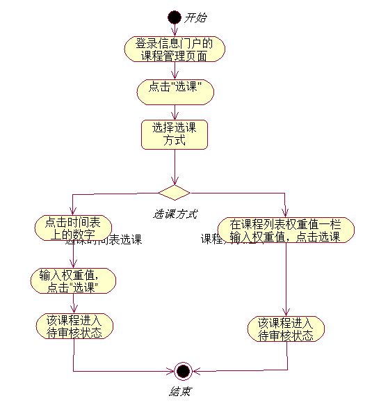

# 「需求分析」课前作业
## 一, 选课流程

## 二. 寻找痛点
1. 切换选课平台时必须先退出当前平台再登录另外的平台，平台之间的切换很不人性化.
2. 选课过于自主，导致部分必修课程因不能显示在课表里而易造成学生漏选.
3. 选课系统上列出的培养方案和学生手里的《本科生培养方案》内容不一致，若以系统中列出的培养方案为依据进行选课，将导致部分必选课程漏选，所以辅导员要求学生以纸质书为准，**该问题自我入学以来从未得到解决!**

## 三. 解决方案
1. 选课时可以同时登录多个平台
2. 退出系统时若必修课未选全，则提示学生
3. 网站管理员应该同步系统上的培养方案和纸质书的内容