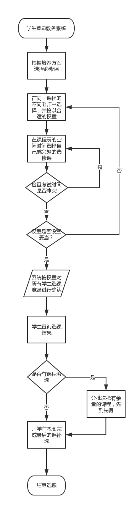
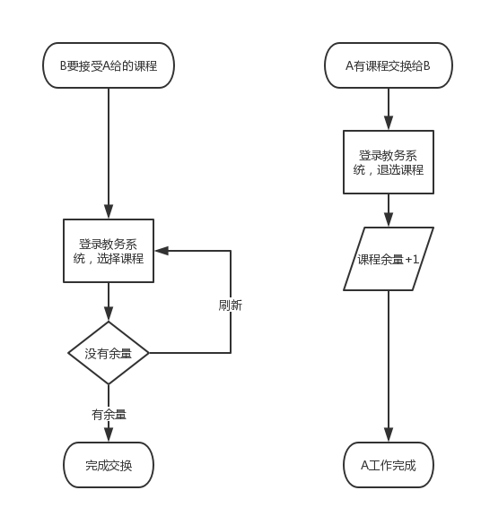
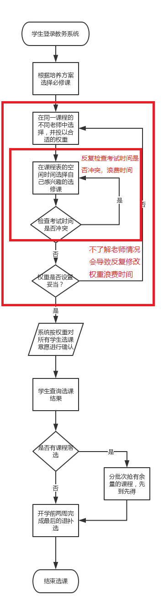
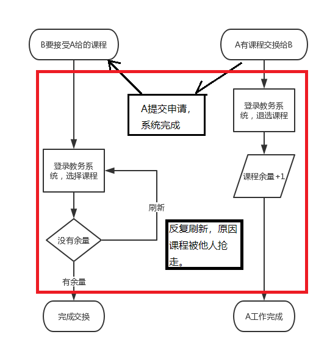

# 需求分析作业

## 要求

```markdown
整理自己学校的选课流程，尝试找出选课流程中3个主要的痛点，进行分析，并尝试找出解决方案。
可以按照以下步骤来完成作业：

1. 总结流程；
2. 寻找痛点；
3. 思考解决方案;
4. 可视化以上三点。
在这个过程中，可以使用任何工具，或者图表形式。
```

## 流程：

1. 学生登录教务系统根据培养方案选择必修课
2. 在同一课程的不同老师中选择，并投以合适的权重
3. 在课程表的空闲时间选择自己感兴趣的选修课，检查考试时间是否冲突，若没有则投以权重
4. 学生完成第一轮选课，由系统按权重对所有学生选课意愿进行确认，若有课程落选需学生自行在系统查看并参与后续抢课
5. 学生分批次抢有余量的课程，先到先得
6. 下学期开学前两周完成最后的退补选，流程类似抢课过程

## 痛点：

1. 对同一课程的老师信息了解过少，选择纠结，增加了选课时间
2. 选择选修课不能直接显示课程考试时间是否冲突，需要手动点击查看
3. 抢到的课程不能与同学直接交换，需要一个同学退了再让另一个同学选，有一定几率中途被抢走

## 解决方案：

1. 增加课程详情，完善老师授课风格的信息
2. 检查课程表课程，给出完整的还能选择的不冲突的课程信息列表
3. 增加课程赠与功能，在两个学生用户之间直接交换课程

## 可视化：

### 选课流程图：



### 交换课程流程图：



### 问题分析及解决：




